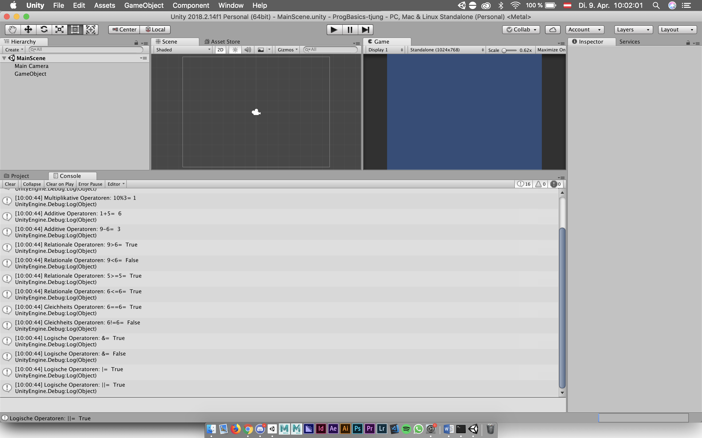
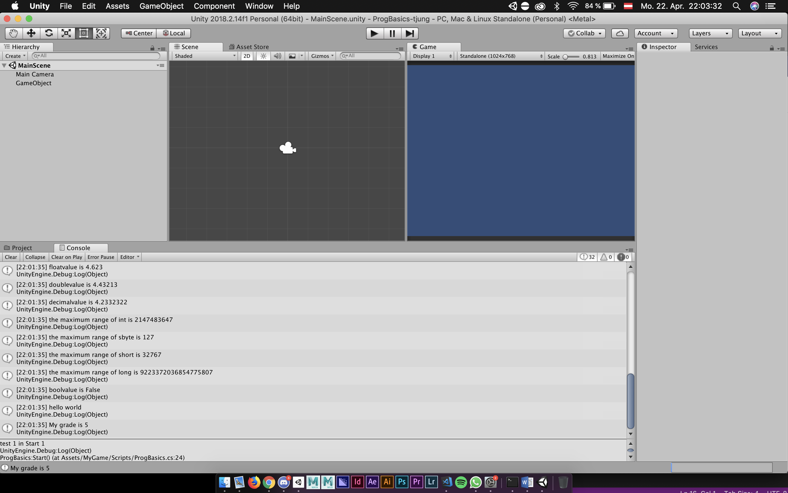

# ProgBasics-tjung

**Progress:** 100%

### Developement Platform:
  - *OS: macOS 10.14.4*
 - *Unity: Version 2018.2.14f1*
 - *Visual Studio: VS-Code Version 1.30.2*  
 - *Scripting Runtime Version: .NET 3.5 Equivalent*
 - *API Compatibility Level: .NET 2.0 Subset*

### Erste Tests mit Operatoren
  Mit Debug.Log in einem C# Script wurden diverse Multiplikative, Additive, Relationale, Gleichheits und Logische Operatoren in die Unity Console geprintet.

 - Screenshots

### Variablen-Typen und Methoden Tests
  Diverse Variablen-Typen und Methoden mit Debug.Log in einem C# Script getestet.

 - Screenshots

### Lessons learned

- Umgang mit Methoden und Variablen in C#

##### © Copyright by Thomas Junger
